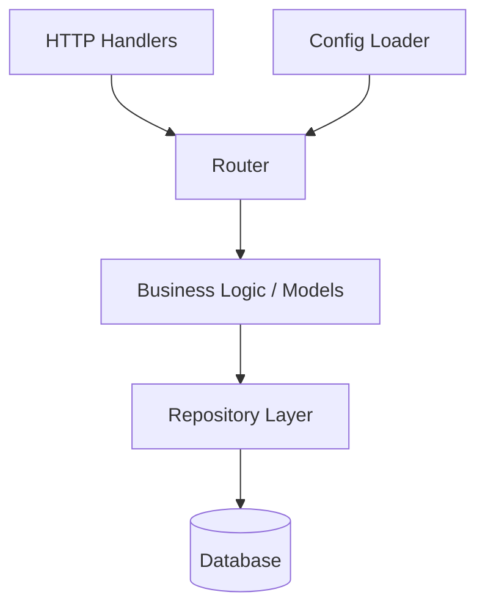

# Personal Finance Tracker API

A backend API for managing personal finance data, built with Go. This service allows users to track transactions and categories, supporting CRUD operations for a personal finance application.

## Features

- RESTful API for managing transactions and categories
- Layered architecture for maintainability and testability
- Repository pattern with GORM ORM for database abstraction
- Environment-based configuration
- Swagger/OpenAPI documentation for easy API exploration
- SQL schema for database initialization

## Architecture

The project follows a layered architecture:



- **Handlers:** HTTP endpoints for categories and transactions ([`api/handlers/`](api/handlers/))
- **Router:** Maps endpoints to handlers ([`api/router.go`](api/router.go))
- **Models:** Domain objects ([`internal/models/`](internal/models/))
- **Repository:** Data access logic, GORM-based ([`internal/repository/`](internal/repository/))
- **Config:** Loads environment variables ([`config/`](config/))
- **Docs:** Swagger/OpenAPI documentation ([`docs/`](docs/))
- **Entry Point:** Application startup ([`cmd/main.go`](cmd/main.go))

## Setup

### Prerequisites

- Go (see `go.mod` for version)
- A supported SQL database (see `database.sql` for schema)
- [Optional] Docker, if you wish to containerize the app

### Installation

1. Clone the repository:
   ```sh
   git clone https://github.com/Jacques-Murray/personal-finance-tracker-api.git
   cd personal-finance-tracker-api
   ```

2. Install dependencies:
   ```sh
   go mod download
   ```

3. Copy the example environment file and configure as needed:
   ```sh
   cp .env.example .env
   # Edit .env to match your environment
   ```

4. Initialize the database using the provided schema:
   ```sh
   # Example for PostgreSQL
   psql -U youruser -d yourdb -f database.sql
   ```

### Running the Application

```sh
go run cmd/main.go
```

The API will start and be accessible at the configured host/port.

## Usage

- Interact with the API using tools like `curl`, Postman, or any HTTP client.
- API documentation is available via Swagger UI at `/docs` (see [`docs/`](docs/)).

## Contributing

Contributions are welcome! Please open issues or submit pull requests for improvements or bug fixes.

## License

This project is licensed under the MIT License - see the [LICENSE](LICENSE) file for details.
